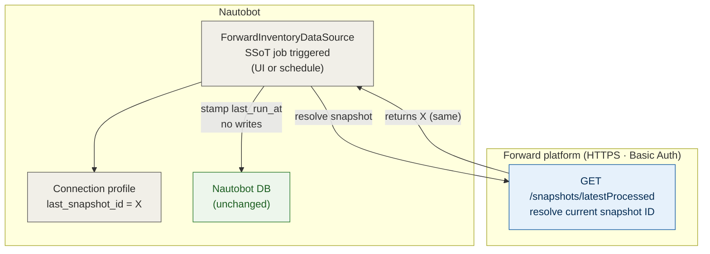
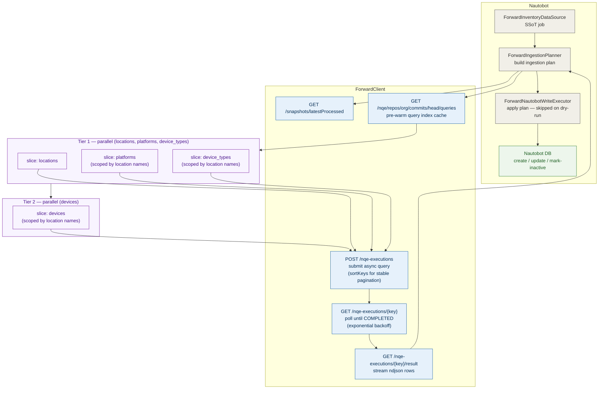
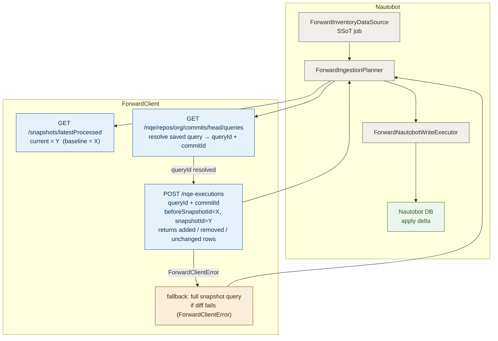
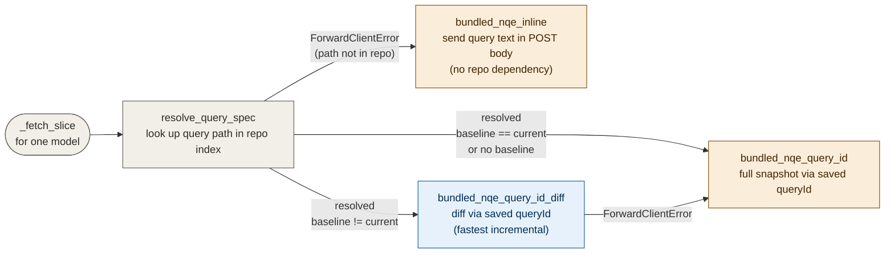

# Forward Networks SSoT — End-to-End Flow

This document shows how the plugin runs end to end across its three execution
modes, the connection types and direction between components, and the Forward
API calls made at each step. Intended for architecture review, onboarding, and
approval workflows.

GitHub renders the Mermaid diagrams below automatically.

---

## Execution modes at a glance

| Mode | When | NQE calls | What changes |
|---|---|---|---|
| **Skip** | `last_snapshot_id == current_snapshot_id` | 0 | Nothing — stamps `last_run_at` only |
| **Snapshot** | First run, or no saved query ID resolves | N slices × async execution | Full row set for each selected model slice |
| **Diff** | Saved query resolves AND baseline ≠ current | N slices × diff execution | Only rows changed between snapshots |

---

## Mode 1 — Skip (snapshot unchanged)

`last_snapshot_id` on the connection profile equals the current processed
snapshot. No NQE calls are made.

---

## Mode 2 — Full snapshot sync

Runs when there is no prior baseline, or when the saved NQE query path cannot
be resolved in the Forward repository (inline NQE fallback). Fetches the
complete row set for every selected model slice.

---

## Mode 3 — Diff sync

Runs when the saved NQE query resolves to a query ID **and** a prior baseline
snapshot exists. Only rows that changed between snapshots are returned, reducing
transfer and parse cost for incremental runs.

---

## NQE query resolution

Each model slice tries to resolve its bundled `.nqe` file to a saved query in
the Forward NQE repository. The query mode recorded in the run output reflects
which path was taken.

---

## Tier parallelism and dependency order

Slices within a tier are dispatched concurrently. Tiers are gated: a tier does
not start until all slices in the prior tier have completed and their rows are
available to inject as query parameters into dependent slices.

```mermaid
flowchart LR
    subgraph t0["Tier 1  (parallel)"]
        locations["locations"]
    end

    subgraph t1["Tier 2  (parallel)"]
        platforms["platforms\n← location names"]
        device_types["device_types\n← location names"]
    end

    subgraph t2["Tier 3  (parallel)"]
        devices["devices\n← location names"]
    end

    subgraph t3["Tier 4  (parallel, disabled by default)"]
        interfaces["interfaces\n← device names"]
        vlans["vlans\n← location names"]
        vrfs["vrfs\n← device names"]
    end

    subgraph t4["Tier 5  (parallel, disabled by default)"]
        ip4["ipv4_prefixes\n← device names"]
        ip6["ipv6_prefixes\n← device names"]
        ipa["ip_addresses\n← device names"]
        inv["inventory_items\n← device names"]
        mod["modules\n← device names"]
    end

    t0 --> t1 --> t2 --> t3 --> t4

    classDef neutral fill:#F1EFE8,stroke:#5F5E5A,color:#2C2C2A;
    class locations,platforms,device_types,devices,interfaces,vlans,vrfs,ip4,ip6,ipa,inv,mod neutral;
```

---

## Forward API calls summary

| Call | When | Purpose |
|---|---|---|
| `GET /networks/{id}/snapshots/latestProcessed` | Every run | Resolve current snapshot ID |
| `GET /nqe/repos/org/commits/head/queries` | Every run (once, cached) | Pre-warm query index; resolve `.nqe` paths to query IDs |
| `POST /networks/{id}/nqe-executions` | Snapshot / diff mode, per slice | Submit async NQE query or diff |
| `GET /networks/{id}/nqe-executions/{key}` | After submit | Poll execution status |
| `GET /networks/{id}/nqe-executions/{key}/result` | Status = COMPLETED | Stream ndjson result rows |

No calls are made in skip mode. Diff mode calls the same execution endpoint
with `beforeSnapshotId` added; it is not a separate endpoint.

---

## Permissions required

### Plugin → Forward (HTTPS · Basic Auth)

| API call | Required Forward permission |
|---|---|
| `GET /snapshots/latestProcessed` | read snapshots |
| `GET /nqe/repos/org/commits/head/queries` | read NQE repository |
| `POST /nqe-executions` | execute NQE |
| `GET /nqe-executions/{key}` | read NQE executions |
| `GET /nqe-executions/{key}/result` | read NQE results |

### Plugin → Nautobot DB (Django ORM, same process)

| Operation | Models touched |
|---|---|
| Read existing objects for diff | `Location`, `Device`, `DeviceType`, `Platform`, `Interface`, `VLAN`, `VRF`, `Prefix`, `IPAddress` |
| Create / update / mark-inactive | Same set — scoped to selected model slices |

### Configuration prerequisites in Nautobot

| Prerequisite | Required for |
|---|---|
| `LocationType` (e.g. `Site`) | Writing locations |
| `Status` with `Location` content type (e.g. `Active`) | Writing locations |
| `Role` with `Device` content type (e.g. `Network Device`) | Writing devices |
| `Status` with `Device` content type (e.g. `Active`) | Writing devices |

All four must exist before the first sync. The plugin does not create them
automatically.

---

## Key operational properties

- **Dry-run safe** — `ForwardNautobotWriteExecutor` is skipped entirely when the
  SSoT job runs with `dryrun=True`. The plan is computed and reported; no DB
  writes occur.
- **Incremental by default** — the planner records `last_snapshot_id` on the
  connection profile after every successful run. Subsequent runs use diff mode
  when the query is resolvable, or skip entirely when the snapshot is unchanged.
- **Scoped queries** — child slices (devices, interfaces, IP addresses, etc.)
  send parent keys as NQE `parameters`, bounding server-side query scope to
  already-known entities.
- **Stable pagination** — all NQE executions include `sortKeys` on the slice's
  identity fields so page boundaries are deterministic across retries.
- **Support bundle** — every run produces a sanitized support bundle alongside
  the SSoT sync record, capturing row samples, query modes, diff summaries, and
  redacted connection metadata for offline diagnostics.
